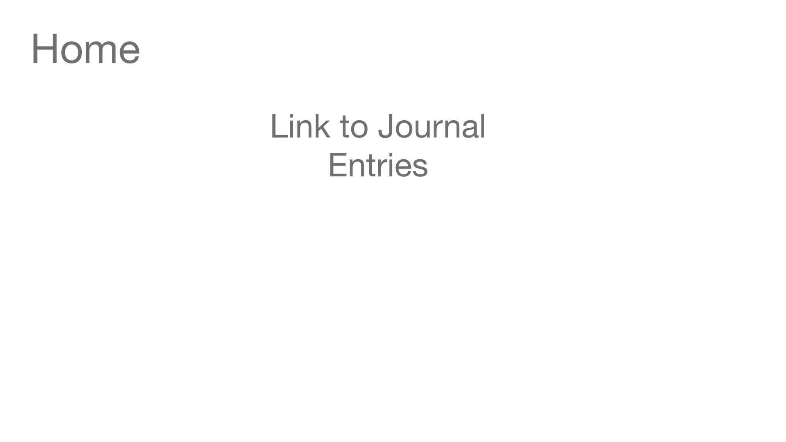
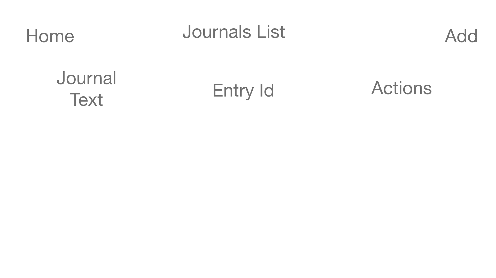
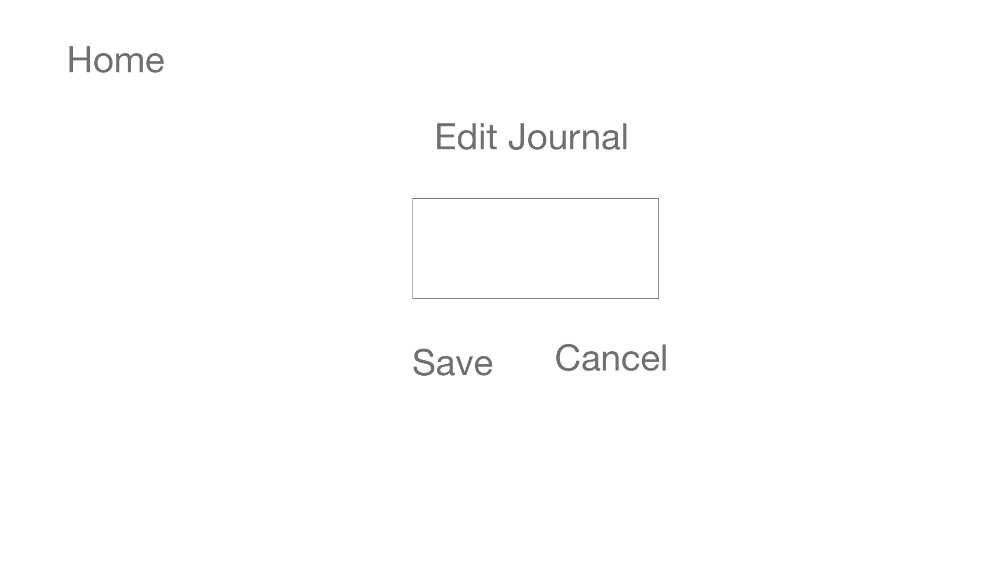
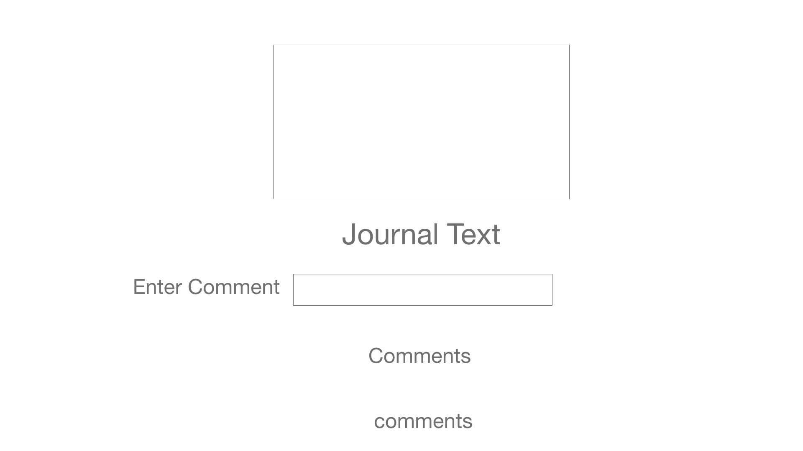

# Lawrence's Journal API

## The third party API I am using is https://unsplash.com/documentation

## Mission Statement
This app is a journal that is meant for people who want to store their writings on the internet.

## Wireframe

## Sources
https://www.youtube.com/watch?time_continue=135&v=nmbX2QL7ZJc&feature=emb_title

https://www.youtube.com/watch?v=rNezWYmyS2w
